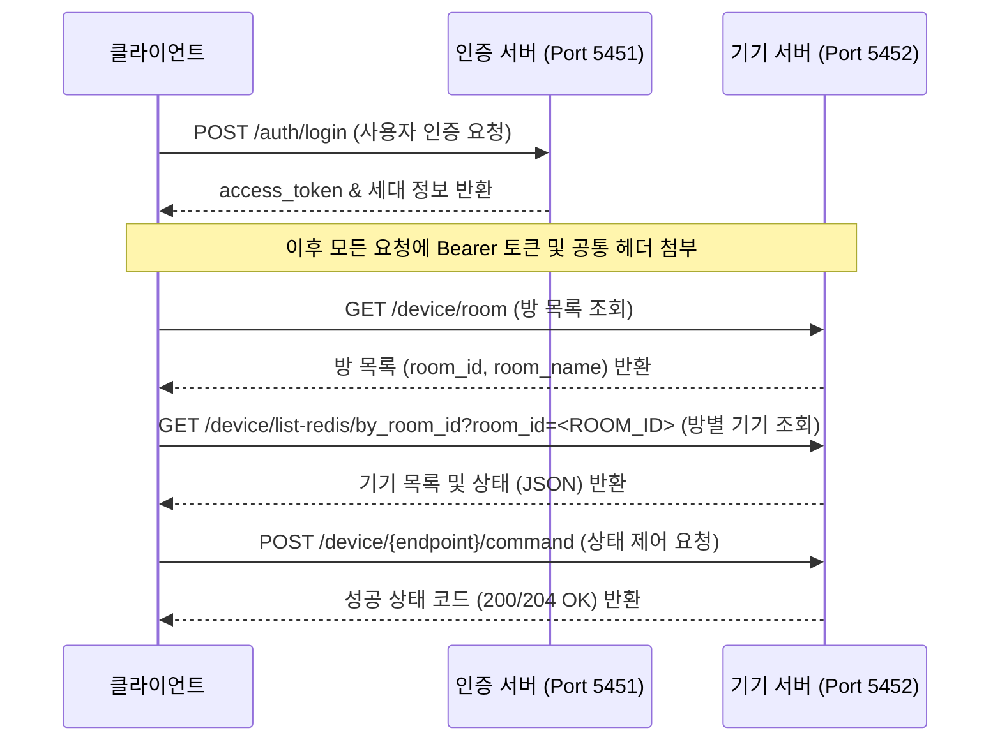

# 자이 스마트홈 (XiHome) 백엔드 API 명세서

본 저장소는 GS건설 자이(Xi) 아파트의 홈네트워크 제어용 스마트홈 시스템(XiHome)의 백엔드 API 규격을 역공학(Reverse Engineering)하여 정리한 명세서입니다.

개발자와 AI 에이전트 모두가 API 규격 및 장치별 상태 제어 동작을 이해하고 쉽게 구현할 수 있도록 상세히 서술되어 있습니다.

---

## 📂 문서 구조

세부 문서 링크를 통해 전체 명세서 내용을 확인하실 수 있습니다.

* 🌐 **[자이 클라우드 API 명세서](api_endpoints.md)**: XiHome 백엔드 서버 호스트 주소, 필수 보안 HTTP 헤더 규격, 세션 및 데이터 관련 REST API 엔드포인트 명세.
* 🔌 **[기기별 데이터 모델 및 제어 명세](device_data_models.md)**: 방 목록 검색 후 수신되는 원본 JSON 데이터와 조명, 난방, 대기전력, 환기장치(시스클라인)를 직접 제어하기 위한 `status` 데이터 바디 구조 정보.

---

## 📌 통신 워크플로우 개요

클라이언트가 자이 스마트홈 서버와 상호작용하기 위한 기본적인 데이터 흐름입니다.

---

## 🔒 연동 보안 및 참고 사항

1. **도메인 접근 제한**: 기기 제어 서버(`:5452`)는 보안 강화를 위해 `Origin` 헤더와 `User-Agent` 및 `Host` 헤더를 엄격하게 매칭하여 체크합니다. 명세서에 정의된 공통 헤더 사양을 정확하게 준수해야 정상적인 응답을 받을 수 있습니다.
2. **동/호 식별값**: 세대를 조회 및 제어할 때 사용되는 `dong_no`와 `ho_no`는 반드시 앞자리의 `"0"` 문자가 제거된 형태로 API 파라미터에 넘겨져야 합니다 (예: `"0101동"` ➡️ `"101"`, `"0502호"` ➡️ `"502"`와 같이 앞자리의 0을 소거).
3. **토큰 주기적 갱신**: `access_token`의 만료 주기에 맞추어 `POST /auth/token` API를 통해 주기적으로 토큰을 리프레시해야 오프라인 상태로 빠지지 않습니다.
4. **도움이 될만한 파일**: 개발을 하는데 도움이 될 파일을 [/docs/files](files/)에 업로드 했습니다.
